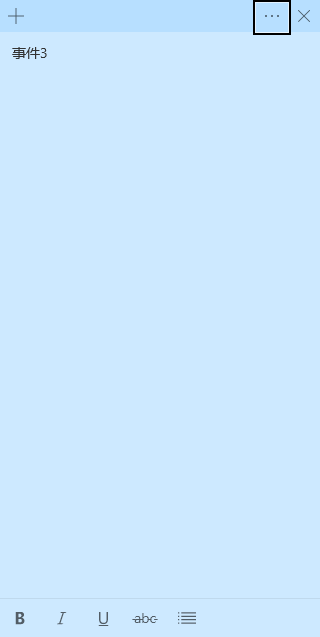

### 功能目标

使用Vue+Vuex+VueRouter制作一个简约风格的Todo-List

### 项目资源

* UI框架可以使用[VantUI](https://youzan.github.io/vant/#/zh-CN/home)

* 若VantUI提供的图标不满足需求，可以使用[iconfont](https://www.iconfont.cn/home/index)

* 以下示例图片均为微软自带的**Sticky Notes**的截图，可以按照自己的喜好进行修改

### 实现功能

#### 添加事项

未添加任何事项事前，首页状态：

> 整体风格可以与图片保持一致，也可以按照自己的风格自定义

展示事项列表：

#### 编辑事项

编辑页面：

> 底部的功能栏可以暂时先不考虑，改为确认按钮

#### 搜索事项

#### 删除事项

#### 删除前确认

#### 背景色控制

通过编辑页面顶部的菜单按钮控制背景色

#### 本地持久化存储

使用`localStorage`存储所有事项，防止页面刷新或关闭后数据丢失
